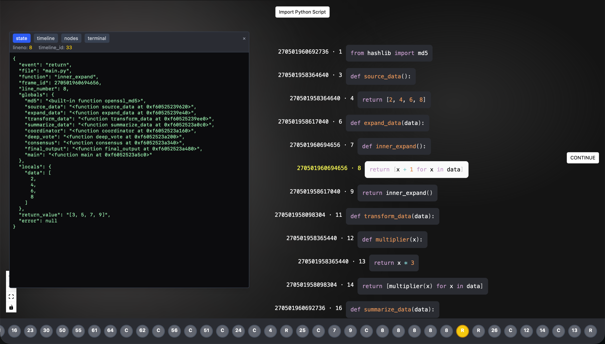
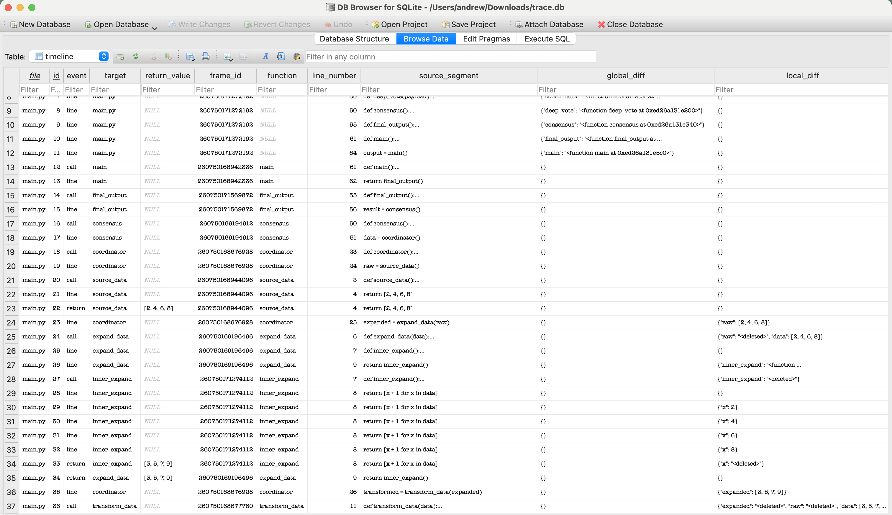

Maybe we can actually dump and restore a Python program’s state **without using CRIU**!

## Idea

- Using `sys.settrace` or `sys._getframe()` we can get the current frame.
- By following `frame.f_back`, we can inspect previous frames and thus obtain the **full call stack**.

``` python
from types import FrameType

def get_stack(frame: FrameType) -> list[FrameType]:
    stack = []
    stack_append = stack.append
    
    while frame is not None:
        stack_append(frame)
        frame = frame.f_back

    stack.reverse()
    return stack
```

- Each frame corresponds to a function call, and we can access its **locals** with `frame.f_locals`, as well as the **line where the function made the call** with `frame.f_lineno`.

With this information, since we can **jump through the frame** with `frame.f_lineno`, we could potentially **restore the entire program state** by:  

- Recreating similar functions, as well as other code blocks like loops and `try-except` blocks, and jumping to the correct point in execution, while restoring their local variables.  
- Or maybe even simply executing the functions and code blocks **using `exec`**, with hardcoded assignments for locals.  

## Potential Obstacles

- Some states might be irreversible.  
- We may need additional information, such as the **function body gathered with the `inspect` module**, to restore the remaining of the function.  
- The AST can also help determine other things, such as `nonlocal` and `global` variables.  

## Potential Benefits

- Running Python in the frontend via WebAssembly, without requiring a backend.  
- Increased efficiency, since this approach wouldn’t require `settrace` to be attached all the time — we could just set a breakpoint and start live debugging from there.

---

install

```
# pwd ./trace/
cd ./api/
source env.sh
git clone https://github.com/herheliuk/criu-python-api ./criu-python-api/ --depth 1
source ./criu-python-api/install.sh
```

```
nano /etc/caddy/Caddyfile
systemctl reload caddy
```

```
:4444 {
        @api {
                path /api/*
        }

        handle @api {
                reverse_proxy localhost:8000
        }

        handle {
                reverse_proxy localhost:8080
        }
}
```

run

```
# pwd ./trace/
docker compose up frontend -d
```

```
# pwd ./api/
source env.sh
sudo -E $(which uvicorn) main:app
```



