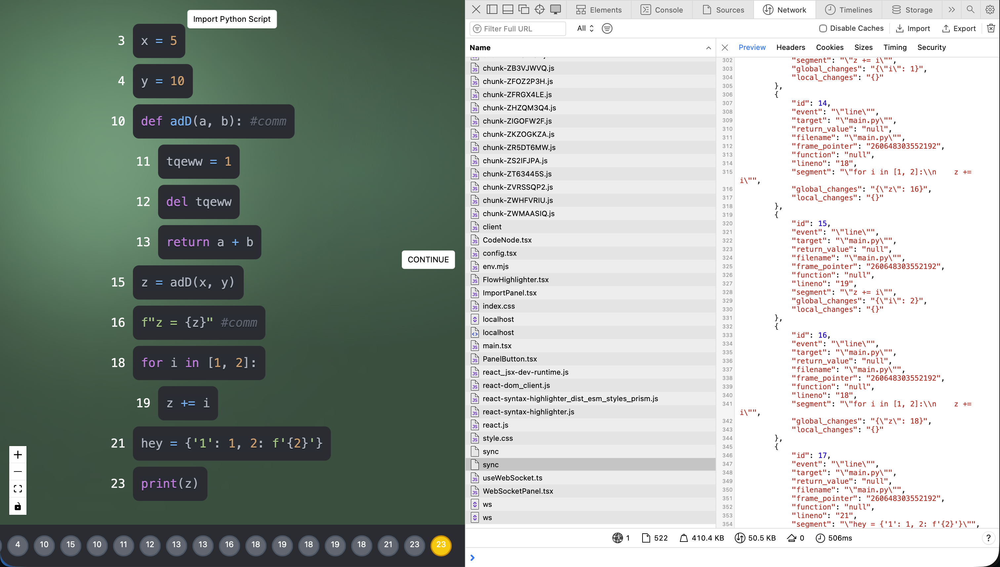

install

```
# pwd ./trace/
cd ./fastapi/
source env.sh
git clone https://github.com/herheliuk/criu-python-api ./criu-python-api/ --depth 1
source ./criu-python-api/install.sh
```

```
nano /etc/caddy/Caddyfile
systemctl reload caddy
```

```
:4444 {
        @api {
                path /api/*
        }

        handle @api {
                reverse_proxy localhost:8000
        }

        handle {
                reverse_proxy localhost:8080
        }
}
```

run

```
# pwd ./trace/
docker compose -f docker-compose.development.yml up frontend -d
cd ./fastapi/
source env.sh
sudo -E $(which uvicorn) main:app
```

term 2
```
# pwd ./fastapi/
source env.sh
python settrace.py
```


